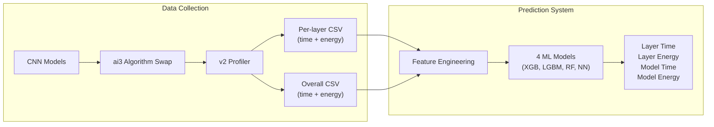

# Research Paper Plan: Predicting CNN Performance Across cuDNN Algorithms and GPUs

## Paper Thesis

Given the large space of cuDNN convolution algorithms, GPU hardware, and layer configurations, choosing the best algorithm is hard. This paper presents a machine-learning-based prediction system that can forecast both latency and energy for individual layers and entire models across multiple algorithms and GPUs -- enabling informed algorithm selection without exhaustive profiling.

---

## Recommended Structure

### 1. Introduction (~1 page)

**What to write:**
- The problem: cuDNN provides many convolution algorithms (GEMM, implicit GEMM, FFT, Winograd, etc.) but the best choice depends on layer shape, model architecture, and GPU hardware.
- Current approach (cuDNN's `cudnnGetConvolutionForwardAlgorithm`) is a heuristic, not always optimal, and doesn't account for energy.
- Gap: no existing tool predicts both time AND energy at both layer and model granularity across GPUs.
- Your contribution (3 bullet points):
  1. Extended the ai3 framework with support for additional cuDNN algorithms (GEMM, implicit GEMM, implicit precomp GEMM, FFT, FFT tiling, Winograd, etc.)
  2. Built a profiling system that collects per-layer timing and energy data across 4 CNN architectures x 9 algorithms x 3 GPUs (~477K+ measurements)
  3. Trained ML models (XGBoost, LightGBM, RF, NN) that predict latency and energy at both layer and model level, with generalization to unseen architectures

### 2. Background and Related Work (~1-1.5 pages)

**Topics to cover:**
- cuDNN convolution algorithms: brief explanation of each (direct, GEMM/im2col, implicit GEMM, FFT-based, Winograd transform). Cite the NVIDIA cuDNN documentation and foundational papers (Lavin & Gray 2016 for Winograd, Vasilache et al. for FFT).
- The ai3 framework: what it provides (algorithmic swapping), cite the JOSS paper ([papers/JOSS/paper.md](papers/JOSS/paper.md)) and the initial proposal referenced therein.
- Related prediction work: prior efforts at predicting DNN execution time (e.g., Paleo, nn-Meter, HABITAT, Halide auto-scheduler). Note that most focus on overall model time, not per-layer energy, and few cover the algorithm dimension.
- GPU energy measurement: NVML-based power monitoring, trapezoidal integration for energy computation.

### 3. System Design (~1.5-2 pages)

**3.1 ai3 Algorithm Extensions**
- Which algorithms you added and how they map to cuDNN backend calls.
- Compatibility constraints (e.g., Winograd requires 3x3 kernels).
- This is a concrete software contribution -- describe it as such.

**3.2 Profiling Infrastructure**
- The unified profiler design: `PowerMonitor`, `CUDALayerTimer`, `UnifiedProfiler` from [Layers/profiler.py](Layers/profiler.py).
- CUDA event timing for precision.
- Continuous NVML sampling with per-layer timestamp slicing for energy attribution. Explain the design choice (continuous thread vs. start/stop per layer) and why.
- Trapezoidal rule for energy integration.

**3.3 Feature Engineering**
- Layer-level features: raw params (in/out channels, kernel, stride, padding, input size) + engineered (FLOPs, output size, memory footprint, compute intensity) from [Layers/feature_engineering.py](Layers/feature_engineering.py).
- Model-level features: architecture descriptors (num_conv_layers, total_params, depth, has_residual, etc.) from the same file.
- Device features: numerical GPU specs (bandwidth, TFLOPS, memory) from [Layers/device_specs.py](Layers/device_specs.py) instead of one-hot encoding -- explain why this helps generalization.

**3.4 ML Prediction Models**
- 4 ML approaches: XGBoost, LightGBM, Random Forest, MLP.
- 4 prediction tasks: layer time, layer energy, model time, model energy.
- Target transform: log1p for skewed distributions.
- Preprocessing: StandardScaler for numerical, OneHotEncoder for categoricals (algorithm).

Include an architecture diagram:

### 4. Experimental Setup (~0.5-1 page)

**What to report:**
- Models: VGG16, DenseNet121, ResNet152, GoogLeNet (and why these were chosen -- different architectures: sequential, dense, residual, inception).
- Algorithms: 9 cuDNN algorithms (list them with 1-line descriptions).
- GPUs: NVIDIA H100 (Hopper), L40S (Ada Lovelace), V100 (Volta) -- different generations and memory architectures.
- Data scale: ~477K layer measurements, ~6,200 overall measurements, 100 input sizes (224-512) per combination.
- Measurement protocol: 10 warmup iterations, 20 measurement iterations, CUDA event timing, NVML power at 0.5ms sampling interval.
- Train/test split: 80/20 random + leave-one-model-out CV.
- Metrics: RMSE, MAE, R-squared, MAPE (on both log-scale and original units).

### 5. Results (~2-3 pages)

This is the most important section. Organize it as four subsections:

**5.1 Layer-Level Latency Prediction**
- Comparison table: XGBoost vs LightGBM vs RF vs NN (RMSE, MAE, R2, MAPE).
- Feature importance analysis: which features matter most (likely compute_flops, input_size, kernel_size).
- Per-algorithm breakdown: is prediction harder for some algorithms (e.g., Winograd)?
- Per-GPU breakdown: does accuracy differ across hardware?

**5.2 Layer-Level Energy Prediction**
- Same structure as 5.1 but for energy.
- Key insight to discuss: is energy prediction harder/easier than time? Are the important features different?

**5.3 Model-Level Latency Prediction**
- Comparison table.
- Which architecture features matter most?
- Leave-one-model-out results: can we predict VGG16 latency when trained only on DenseNet/ResNet/GoogLeNet?

**5.4 Model-Level Energy Prediction**
- Same structure.
- Relationship between time and energy at model level (are they correlated? Does predicting one help predict the other?).

**Figures to include:**
- Predicted vs. actual scatter plots (one per task, best model).
- Feature importance bar charts.
- Leave-one-model-out accuracy per held-out model.
- Per-algorithm error comparison.

### 6. Discussion (~0.5-1 page)

**Points to discuss:**
- Which ML model performs best overall and why (tree-based models typically win on tabular data).
- Generalization: how well does leave-one-model-out work? What does this imply for deploying the predictor on new architectures?
- NVML sampling limitations: for very fast layers (under 1ms), power samples may be sparse. Discuss this as a limitation and how you mitigated it.
- Practical application: how could this predictor be integrated into ai3 for automatic algorithm selection?
- Comparison to cuDNN's built-in `guess` heuristic: does the predicted-best algorithm outperform `guess`?

### 7. Conclusion and Future Work (~0.5 page)

- Summarize contributions.
- Future work ideas:
  - Extend to more GPU types (A100, RTX 4090).
  - Extend to more models and operation types (BatchNorm, attention layers).
  - Online learning: update the predictor as new profiling data comes in.
  - Integration into ai3 as an automatic algorithm selector.

### 8. References

Key references to include:
- ai3 framework (JOSS paper + initial proposal)
- cuDNN documentation and papers
- Winograd: Lavin & Gray, "Fast Algorithms for Convolutional Neural Networks" (2016)
- im2col/GEMM: Chellapilla et al., "High Performance Convolutional Neural Networks for Document Processing" (2006)
- FFT convolution: Vasilache et al., "Fast Convolutional Nets With fbfft" (2015)
- Related prediction work: Paleo, nn-Meter, HABITAT
- XGBoost: Chen & Guestrin (2016)
- NVML documentation

---

## Execution Order

1. **Run experiments first** -- you need the numbers before writing. Run the v2 profiler on the cluster, train all 4 predictors, run `evaluate.py`. Save all output.
2. **Write sections 4 and 5** first (Experimental Setup and Results) -- these are the most concrete and anchored to your data.
3. **Write section 3** (System Design) -- describe what you built.
4. **Write section 2** (Background) -- literature review. This can be done in parallel with experiments.
5. **Write sections 1, 6, 7** last (Intro, Discussion, Conclusion) -- these frame the story and are easier once you see the results.
6. **Create figures** alongside the results section.
7. **Iterate with your professor** after the first draft of sections 3-5.

---

## Tools and Format

- Use LaTeX with a conference template (IEEE or ACM depending on venue -- clarify with your professor).
- Use matplotlib/seaborn for figures (can add a `Layers/plot_results.py` script later).
- Keep a running BibTeX file as you collect references.
